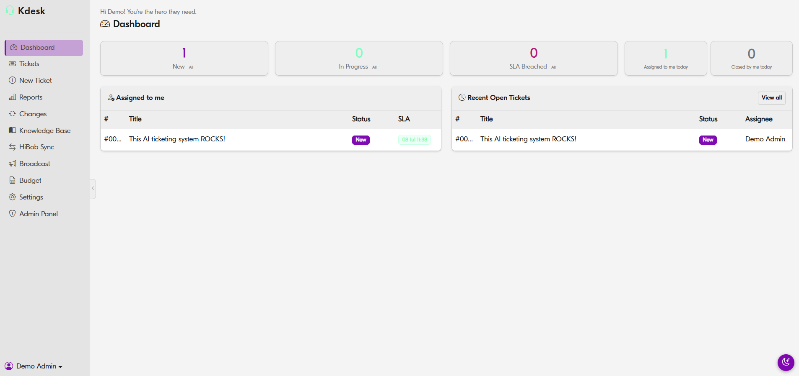
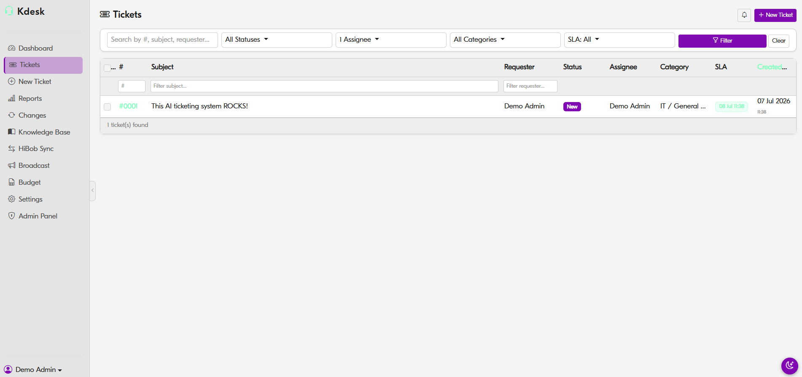
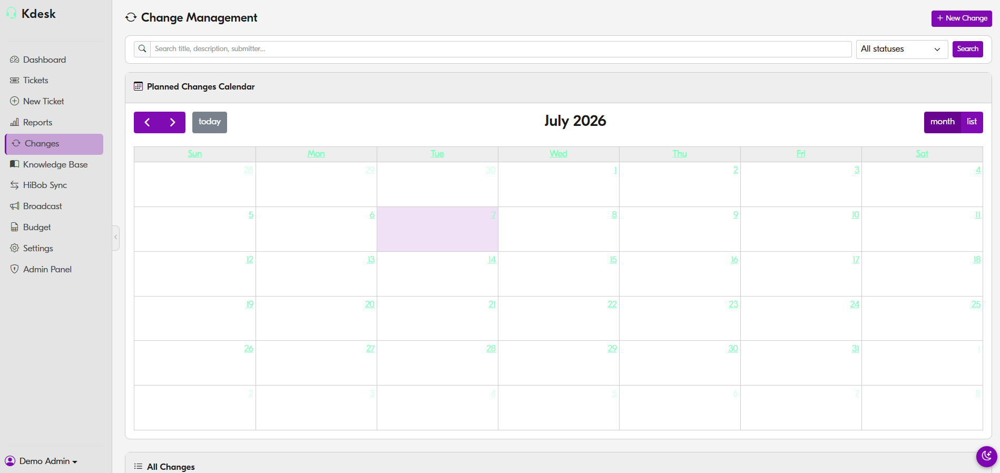
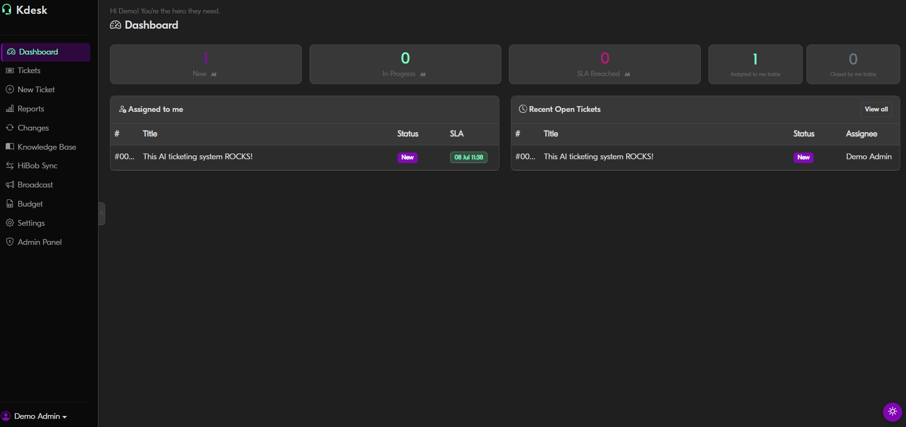
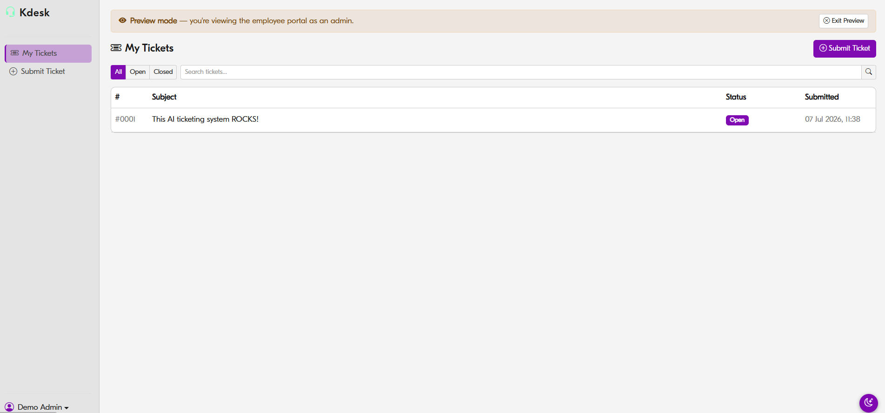

# Kdesk — IT Helpdesk System

A full-featured internal IT helpdesk built for a 500-person organisation. Handles the full ticket lifecycle, change management, a self-service employee portal, SLA tracking, AI-powered diagnostics, and more — all in a single Django app.



## Features

**Ticketing**
- Full ticket lifecycle: New → In Progress → Pending → Resolved → Closed
- SLA tracking with breach alerts and colour-coded urgency indicators
- Category/subcategory routing, assignee management, CC support
- File attachments, inline comments, full audit history

**Employee portal**
- Self-service ticket submission and status tracking
- Employees see only their own tickets; admins see everything



**Change management**
- Calendar and list views for planned infrastructure changes
- Risk level, affected system/region, rollback plan
- Approval workflow with automatic employee broadcast on approval



**HiBob → AD → Microsoft 365 sync**
- Bi-directional sync: changes in HiBob (department, manager, display name, etc.) are written directly to on-premises Active Directory and propagated to Microsoft 365
- Fully automated onboarding: new employees trigger account creation, licence assignment, group memberships, and welcome communications without manual intervention
- Fully automated offboarding: terminations trigger account disabling, licence reclamation, group removal, and data handover — all sequenced and logged
- Post-job verification agent: after every provisioning run, an AI agent inspects the result, automatically remediates fixable issues, and escalates hard-coded high-risk failures (e.g. incomplete offboarding, licence conflicts) directly to superusers as Kdesk tickets for manual review

**Knowledge base** — searchable internal documentation  
**Budget module** — IT budget tracking and upload management  
**Broadcast** — send organisation-wide or region-specific announcements  
**AI diagnostics** — Claude-powered root-cause analysis on escalated tickets  
**Reports** — ticket volume, SLA performance, team workload

## Tech Stack

| Layer | Technology |
|---|---|
| Backend | Django 4.2, Python 3.11 |
| Task queue | Celery + Redis |
| Database | PostgreSQL (SQLite in demo mode) |
| Frontend | Django templates, Bootstrap 5 |
| Auth | Azure Entra ID SSO (demo: auto-login) |
| AI | Anthropic Claude API, Groq |
| Deployment | Docker, Azure Container Apps |

## Running Locally (Demo Mode)

No Azure account needed — one command gets you a fully working instance.

**Prerequisites:** [Docker Desktop](https://www.docker.com/products/docker-desktop/)

```bash
git clone https://github.com/omricn/kdesk.git
cd kdesk
cp .env.example .env
docker compose up -d
docker compose exec web python manage.py migrate
```

Then open **http://localhost:8000/demo-login/** — you'll be logged in automatically as a demo admin.

> Add your own `ANTHROPIC_API_KEY` or `GROQ_API_KEY` to `.env` to enable the AI features.

## Screenshots

### Dashboard


### Ticket Queue


### Employee Portal


### Change Management

